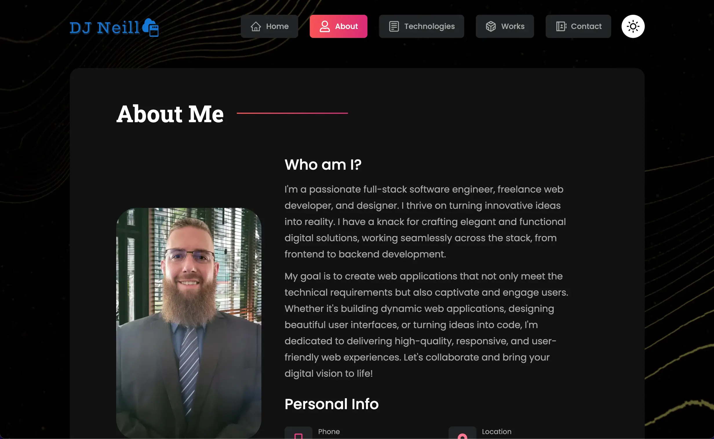

# My React Portfolio

# Overview

Welcome to my personal portfolio repository! This project showcases my skills, projects, and experiences as a web developer. Built using React, this portfolio provides an interactive and visually appealing way for visitors to learn more about me and explore my work.

Take a look at it here 👉 https://djneill.com/

# Features

Responsive Design: The portfolio is designed to be accessible and visually pleasing on a variety of devices and screen sizes.

Project Showcase: Highlighting my key projects, complete with descriptions and links to their respective repositories or live demos.

About Me Section: A brief introduction to who I am, my skills, and my passion for web development.

Contact Information: Easy ways for visitors to get in touch with me, whether through email, LinkedIn, or other social media.

# Technologies Used

React, Javascript, Tailwind CSS, Netlify
